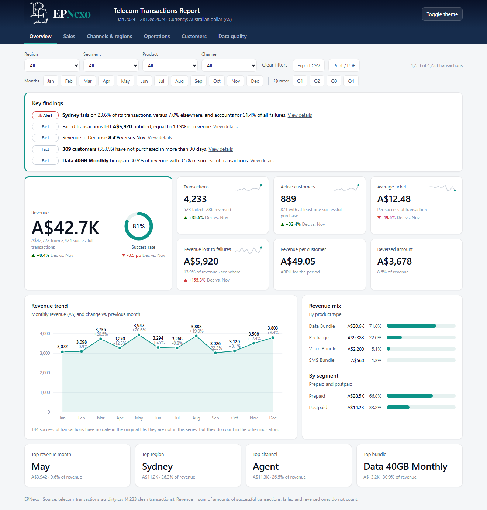
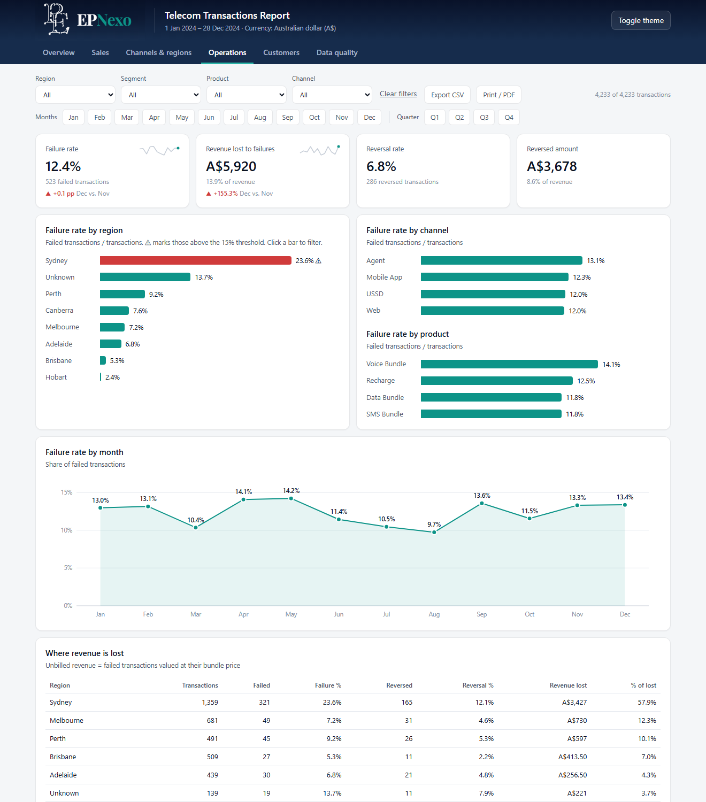
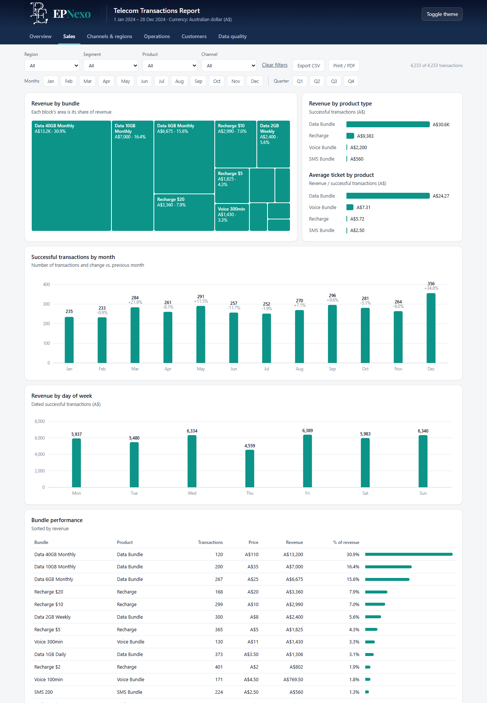
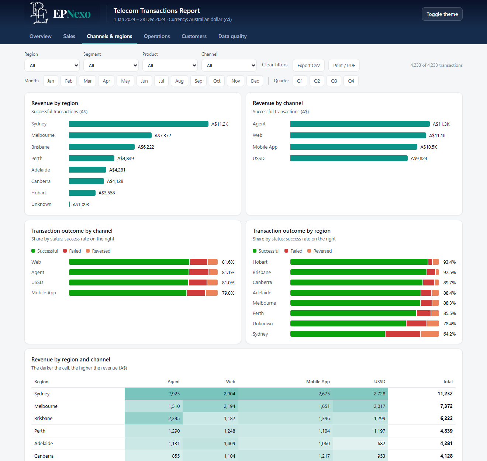
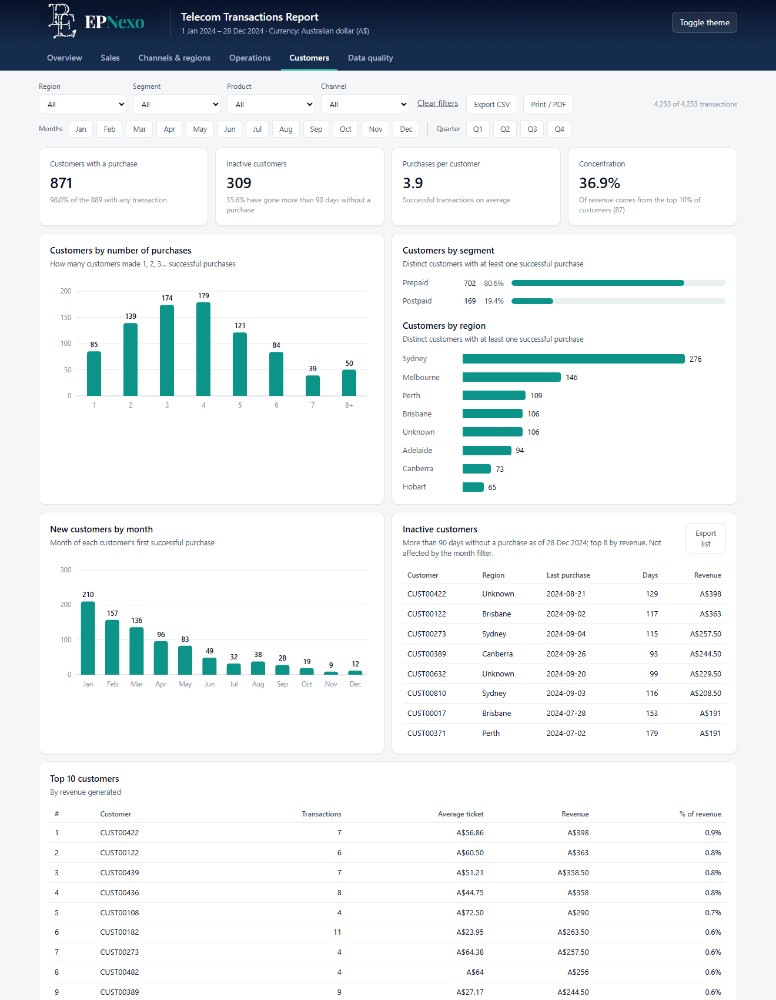
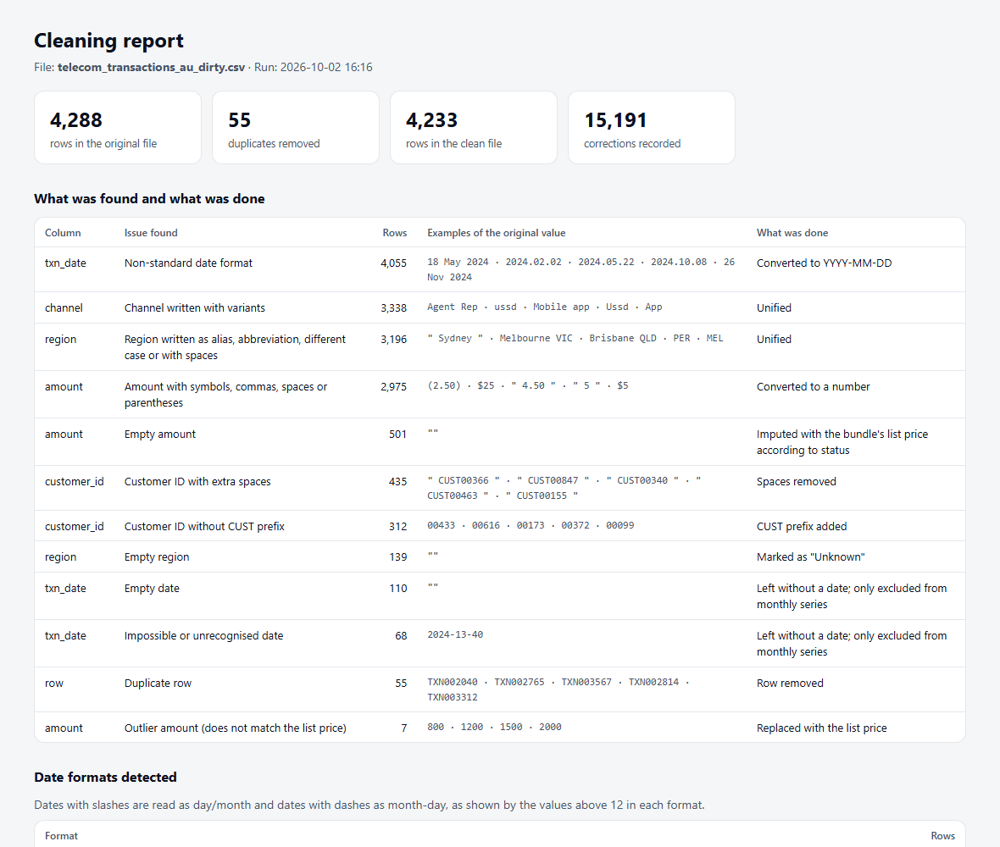
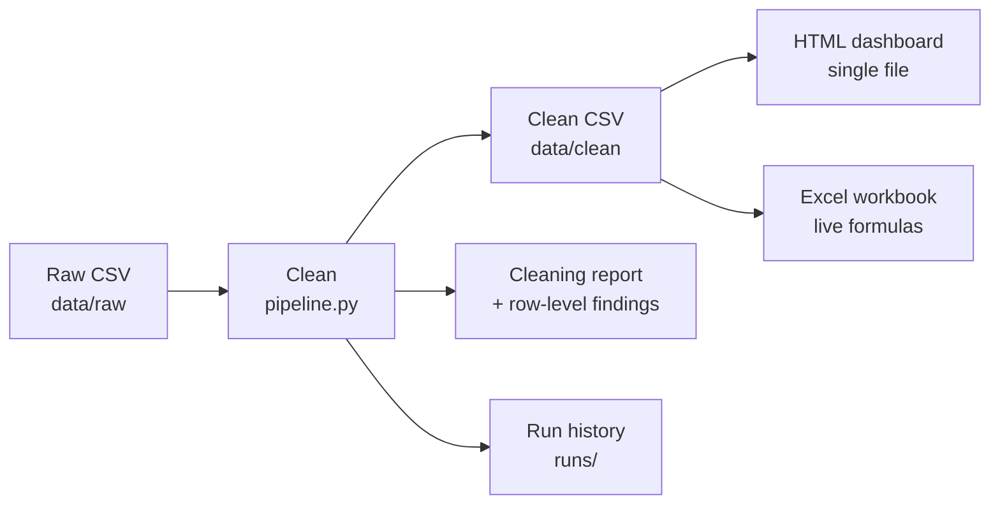

<div align="center">

# Telecom Transactions Report

**From a messy CSV to an interactive dashboard, an Excel workbook and a cleaning report — in about two seconds, with one double-click.**


[Why](#why-this-project) · [Screenshots](#screenshots) · [How it works](#how-it-works) · [Run it](#run-it-step-by-step) · [Customise](#customise-without-touching-code)



</div>

> [!NOTE]
> **Demo data.** The file in `data/raw/` is synthetic demo data styled for Australia (AUD,
> Australian cities). It was derived from a public Nigerian sample by `scripts/make_demo_au.py`
> and does not represent real Australian figures.

## Why this project

Building a report as a plain HTML file is **one more option** for speeding up reporting and
automating how information is presented. A script reads the data, cleans it, and writes a single
file that anyone can open in a browser — no licences, no server, nothing to install for the reader.

It is **not a replacement for Power BI, Tableau or similar tools**. Those remain the right choice
for governed data models, scheduled refresh, row-level security and self-service exploration
across many sources. This approach sits alongside them and fits when you need to:

- turn a recurring file into a consistent report in seconds, without manual steps;
- share a report with someone who has no BI licence — the file can be emailed or dropped in a
  shared folder;
- keep full control over layout, branding and the logic behind every number;
- document the data cleaning next to the results.

> [!IMPORTANT]
> **It is a snapshot.** The dashboard shows the data exactly as it was when the report was
> generated. Filters and charts are interactive, but the numbers do not refresh by themselves:
> there is no live connection to the source. To see newer data, run the pipeline again.

| | HTML report (this project) | BI tool (Power BI and similar) |
|---|---|---|
| Data freshness | Snapshot at generation time | Scheduled or live refresh |
| Reader needs | A web browser | Licence or viewer access |
| Sharing | One file by email or shared folder | Workspace, app or portal |
| Data volume | Small to medium (data is embedded in the file) | Large, modelled datasets |
| Security | Whoever has the file sees everything in it | Roles and row-level security |
| Changes to layout or logic | Edit the template or script | Edit the report in the tool |

## Screenshots

The dashboard has six pages. The Overview is shown at the top; open the others below.

<details open>
<summary><b>Operations</b> — failure rates with alert threshold, and where revenue is lost</summary>
<br>



</details>

<details>
<summary><b>Sales</b> — revenue by bundle, product, month and day of week</summary>
<br>



</details>

<details>
<summary><b>Channels &amp; regions</b> — revenue and transaction outcome by region and channel</summary>
<br>



</details>

<details>
<summary><b>Customers</b> — purchase frequency, new and inactive customers, top 10</summary>
<br>



</details>

<details>
<summary><b>Cleaning report</b> — what was wrong in the source file and what was done</summary>
<br>



</details>

### What you can do in the dashboard

| Feature | How |
|---|---|
| Filter everything | Region, segment, product and channel drop-downs; month and quarter chips |
| Click to filter | Click a bar for a region, channel, product or segment; click again to clear |
| Compare periods | Every indicator shows its change against the previous period, with a 12-month sparkline |
| Read the key findings | Rule-based sentences at the top of the Overview, recalculated with every filter |
| Spot problems | Regions above the failure threshold are flagged in red with a warning mark |
| Export | *Export CSV* downloads the filtered transactions; the Customers page exports inactive customers |
| Print or save as PDF | *Print / PDF* button |
| Light or dark | *Toggle theme* button |

## How it works



1. **Read** the newest CSV in `data/raw/` and check that the required columns are present.
2. **Clean** it: remove duplicates, normalise dates and amounts, unify region and channel names,
   impute empty amounts and correct outliers. Every correction is recorded.
3. **Write the cleaning evidence**: a readable cleaning report, a row-by-row list of corrections
   and a summary of counts.
4. **Build the dashboard**: the clean data is embedded into an HTML template together with the
   logo and settings, producing one self-contained file.
5. **Build the Excel workbook** with the same indicators as live formulas over the data sheet.
6. **Log the run** in `runs/history.csv`, so there is a record of what was processed and when.

<details>
<summary><b>What the cleaning does, in detail</b></summary>
<br>

- Removes duplicate rows by `transaction_id`.
- Normalises dates written in five formats (`DD/MM/YYYY`, `MM-DD-YYYY`, `YYYY.MM.DD`,
  `DD Mon YYYY`, Excel serials) to `YYYY-MM-DD`; impossible or empty dates are left blank.
- Strips currency symbols, codes, commas and spaces from amounts; parentheses mean negative.
- Imputes empty amounts with the bundle's list price (its most frequent successful amount) and
  replaces outliers that do not match it. Both cases are flagged in `amount_flag`.
- Unifies region and channel aliases using `scripts/rules.json`.
- Fixes customer IDs with stray spaces or a missing `CUST` prefix.

</details>

## What you get

| Output | Description |
|---|---|
| [`reports/telecom_report.html`](reports/telecom_report.html) | Single-file dashboard with six pages: Overview, Sales, Channels & regions, Operations, Customers, Data quality. Download it and open it in a browser. |
| [`reports/telecom_report.xlsx`](reports/telecom_report.xlsx) | Summary (live formulas), Charts, Data and Cleaning sheets. |
| [`cleaning/cleaning_report.html`](cleaning/cleaning_report.html) | What was wrong in the source file and what was done about it. |
| [`cleaning/findings_detail.csv`](cleaning/findings_detail.csv) | Every correction, row by row, with the value before and after. |
| [`data/clean/`](data/clean) | The cleaned dataset. |

## Run it, step by step

1. **Install Python 3.10 or later** on Windows (<https://www.python.org/downloads/>).
2. **Install the two packages** used for the Excel file:

   ```
   python -m pip install openpyxl pillow
   ```

3. **Put your CSV in `data/raw/`.** The newest file in that folder is the one processed. It must
   have these columns:

   ```
   transaction_id, txn_date, customer_id, region, customer_segment, product_type,
   bundle_name, channel, data_volume_mb, amount, status
   ```

4. **Double-click `run.bat`** and press *Clean and build report*. Or, from a terminal:

   ```
   python scripts/pipeline.py --open
   ```

5. **Open the results** with the buttons in the window: the dashboard, the Excel workbook and
   the cleaning report.
6. **Share** `reports/telecom_report.html`. It is a single file and works offline.
7. **Repeat from step 3** whenever there is new data. Each run replaces the previous report.

## Customise without touching code

| File | What it controls |
|---|---|
| [`scripts/settings.json`](scripts/settings.json) | Currency label, revenue and success-rate targets, failure alert threshold, inactivity window. |
| [`scripts/rules.json`](scripts/rules.json) | Region and channel aliases. |
| [`scripts/logo.png`](scripts/logo.png) | Logo shown in the dashboard header and the Excel workbook. |

<details>
<summary><b>Project layout</b></summary>
<br>

```
run.bat                  double-click launcher
scripts/
  pipeline.py            cleaning + report generation (standard library only)
  excel.py               Excel workbook (openpyxl)
  app.py                 small desktop window (tkinter)
  report_template.html   dashboard template (HTML + CSS + vanilla JS, no libraries)
  make_demo_au.py        one-off generator of the Australian demo file
data/raw|clean|source    input, cleaned output, original sample
cleaning/                cleaning report and row-level findings
reports/                 HTML dashboard and Excel workbook
docs/images/             screenshots used in this README
```

</details>

---

<div align="center">Built by <b>EPNexo</b></div>
